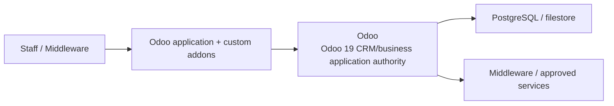
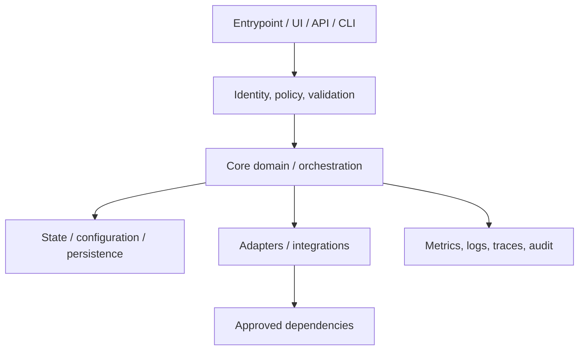
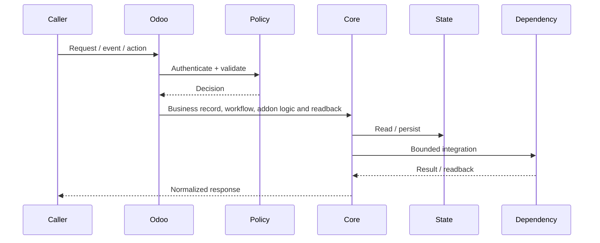
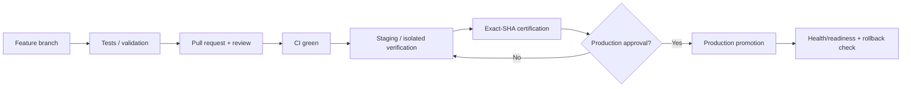
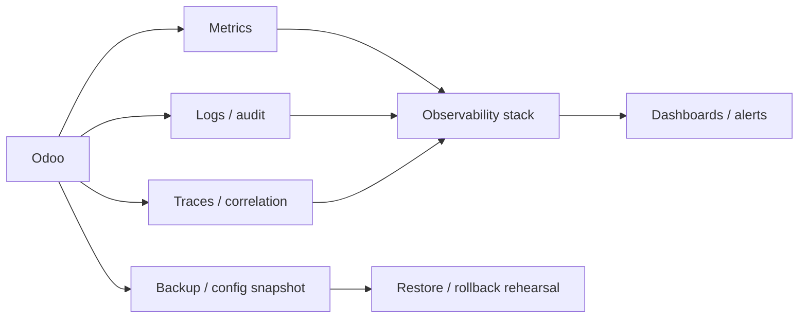

# Odoo — Architecture Charts

> Repository: `appolon1908/Odoo`  
> Baseline branch: `main`  
> Repository-local visual architecture. Update with every material boundary, persistence, integration or deployment change.

## 1. System context

## 2. Internal architecture

## 3. Critical flow

## 4. Deployment and promotion

## 5. Observability and recovery

## Ownership notes
- **Role:** Odoo 19 CRM/business application authority
- **Primary boundary:** Odoo application + custom addons
- **State/config:** PostgreSQL / filestore
- **Dependencies/consumers:** Middleware / approved services
- Cross-repository effects must use reviewed contracts; production effects remain separately gated.
